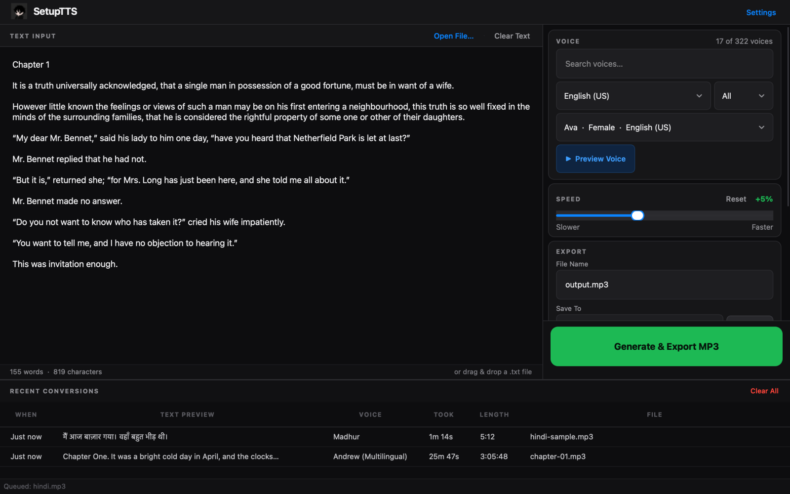
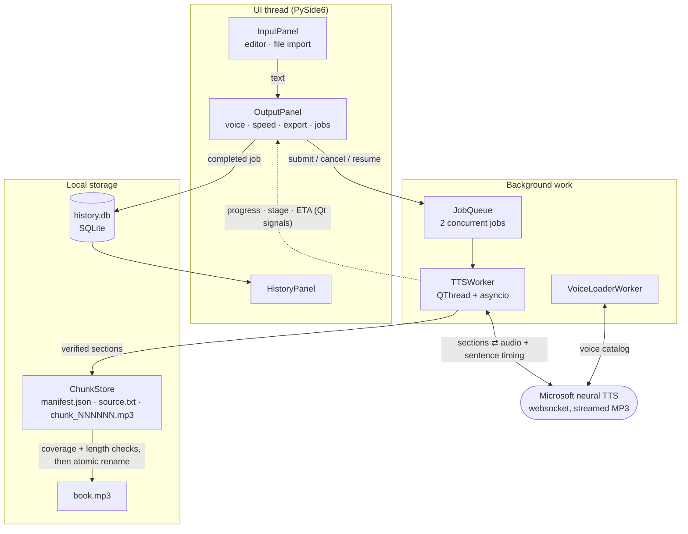
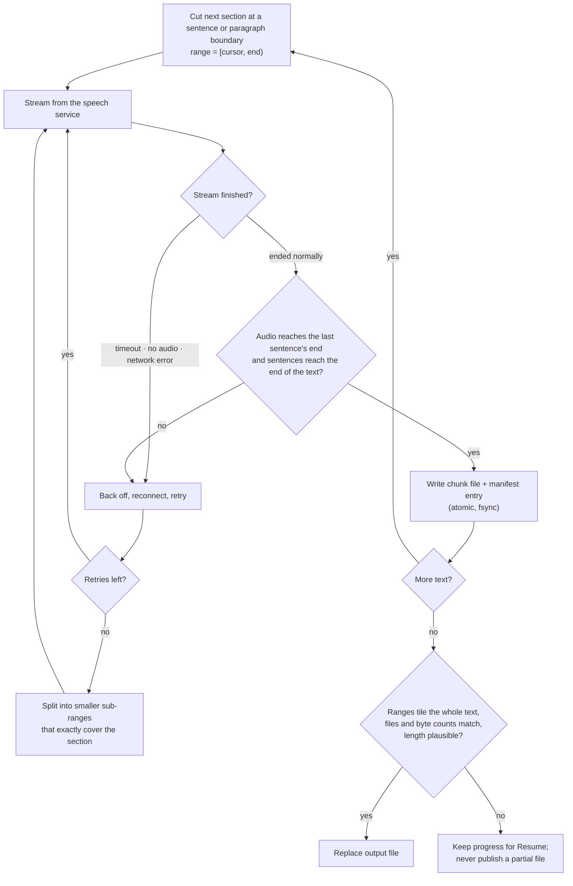

<p align="center">
  
</p>

<h1 align="center">SetupTTS</h1>

<p align="center">
  A desktop app that turns text into MP3 audio with Microsoft's neural voices,<br>
  built to finish 12-hour audiobooks without silently losing a sentence.
</p>

<p align="center">
  <a href="../../releases/latest"></a>
  <a href="../../actions/workflows/build.yml"></a>
  
  
  
</p>

<p align="center">
  
</p>

---

## Download

**[Latest release →](../../releases/latest)**

| Platform | File |
|----------|------|
| macOS 15+ (Apple Silicon) | `SetupTTS-macOS.dmg` — drag to Applications (or `SetupTTS-macOS.zip`) |
| Windows 10/11 (64-bit) | `SetupTTS-Windows-Installer.exe` (or `SetupTTS-Windows-Portable.zip`, no install) |

The apps are not code-signed. On macOS, the first launch may need **System Settings ▸ Privacy & Security ▸ Open Anyway**; on Windows, **SmartScreen ▸ More info ▸ Run anyway**.

---

## What it does

Paste text or open a `.txt` file, pick one of 300+ voices in 70+ languages, and export an MP3. Short clips take seconds; a full book runs in the background with live progress, and can be stopped and resumed later — even after closing the app.

The hard part is not calling a speech API; it is making a **multi-hour job over an unreliable connection** come out complete. The service accepts a few thousand characters per request, so a book becomes a few hundred requests, any of which can time out, return nothing, or — worst of all — end early without an error. SetupTTS treats every one of those as a normal event and refuses to hand over a file it cannot prove is complete.

---

## Engineering highlights

- **Detecting silent truncation.** The streaming client ends quietly if the websocket closes mid-response, returning partial audio as if it were whole. Each section is verified against the service's own sentence timing (offset + duration, in 100 ns ticks) and the byte length of the 48 kbit/s CBR stream, plus a check that the announced sentences reach the end of the section's text. Validated against complete streams from 36 voices in 9 languages (zero false alarms) and against every possible cut point of real streams (all detected).
- **Crash-safe, resumable pipeline.** Every finished section is written to a staging folder with a manifest recording its exact `[start, end)` character range and a hash of that text. Writes are atomic (unique temp file, `fsync`, rename, with retries for transient Windows file locks). After a crash, power loss or cancel, only the verified contiguous prefix is trusted, and the job continues from there.
- **Fail-closed assembly.** Before the MP3 is written, the ranges must tile the source text exactly (no gaps, no overlaps), every chunk file must exist with the recorded size, the assembled byte count must match, and the audio length must be plausible for the text. The length check runs on a temporary file *before* it replaces anything, so a bad result can never overwrite an existing good file.
- **Adaptive recovery.** Retries with exponential backoff and a fresh connection each time; sections that keep failing are split into smaller sub-ranges whose union must equal the original range exactly.
- **Responsive UI during long work.** Generation runs on `QThread` workers with their own `asyncio` loops; the UI thread only receives throttled progress signals. Up to two jobs run concurrently with per-destination conflict checks.
- **Tested as shipped.** 318 automated tests, including 12-hour-scale simulations and regression tests that fail on the pre-fix code. CI also launches the *packaged* apps — the macOS bundle, the app inside the DMG, the app installed by the real Windows installer, and the portable EXE — and has each one load the voice list and synthesise a verified sample.

---

## Architecture



### Life of one section



---

## Failure behaviour

| What goes wrong | What SetupTTS does |
|---|---|
| Connection drops in the middle of a section | Detects the missing audio, discards the attempt, requests the section again |
| DNS failure, timeout, service returns no audio | Retries with backoff; splits stubborn sections; if it still fails, keeps finished sections and offers **Resume** |
| App closed or crashes mid-book | Finished sections survive on disk; **Resume Unfinished Job** continues from the first unverified section |
| Disk full or file locked while saving | Job stops with a plain explanation and stays resumable |
| A chunk file or the manifest is damaged | Resume trusts only the verified contiguous prefix and regenerates the rest |
| Final audio far shorter than the text implies | The file is not saved under your name; an existing file is left untouched and the suspect audio is kept as `name (incomplete).mp3` |
| Output file already exists | Asks: **Keep Both** (`name (2).mp3`) or **Replace** |
| Second copy of the app launched | Brings the running window to the front instead of sharing its files |

---

## Codebase at a glance

Counted with `wc -l` over tracked files at v1.6.0 (includes comments and docstrings).

| Area | Files | Lines | Contents |
|---|---:|---:|---|
| `app/workers` | 6 | 4,734 | generation pipeline, chunk store, job queue, voice loading, preview |
| `app/ui` | 10 | 3,942 | main window, panels, dialogs, stylesheet loader |
| `app/services` | 4 | 1,333 | speech-service client, text profiling and voice matching, history DB |
| `app/utils`, `app/models`, `app/config` | 12 | 1,062 | paths, logging, errors, MP3 parsing, settings, single-instance lock |
| `app/main.py`, `app/selftest.py` | 3 | 277 | startup, packaged-build self-test |
| **Application total** | **35** | **11,348** | Python |
| `tests` | 11 | 3,736 | 318 tests (pytest, pytest-qt) |
| Stylesheet | 1 | 1,078 | Qt stylesheet (dark theme) |
| Build and CI | 7 | 1,243 | PyInstaller specs, Inno Setup installer, GitHub Actions, build scripts |

| Layer | Technology |
|---|---|
| UI | PySide6 (Qt 6) — widgets, QThread, QLocalServer |
| Speech | edge-tts over aiohttp websockets (Microsoft neural voices) |
| Storage | SQLite (history), JSON manifest + per-section MP3 files (resume) |
| Packaging | PyInstaller; DMG via create-dmg; Inno Setup installer; single-file portable EXE |
| CI/CD | GitHub Actions: tests on macOS and Windows, packaged-app self-tests, release publishing |

---

## Using SetupTTS

1. **Add text** — paste or type, **Open File…** (Ctrl/⌘+O), or drag a `.txt` file in. UTF-8, UTF-16 and ANSI files are recognised.
2. **Choose a voice** — search by name or language; **Preview Voice** plays a sample. "(Multilingual)" voices can read mixed-language text; standard voices are more reliable for long English books.
3. **Speed** — −50% to +100%; **Reset** returns to normal.
4. **Export** — file name and folder, then **Generate & Export MP3** (Ctrl/⌘+Enter).

Progress appears under **Active Jobs**: stage, percentage, section count, speed and — once reliable — time left. Finished files appear in **Recent Conversions** with generation time and audio length; double-click to play.

## Requirements and limitations

- **Internet required.** Speech is generated by Microsoft's online service (the voices behind Edge's Read Aloud); text preparation, verification and file writing are local. The service is used without an official API agreement, so its availability can change.
- Generation speed depends on the service and your connection, not your CPU — low CPU use while generating is expected.
- Output is 24 kHz, 48 kbit/s mono MP3 (the format the service provides).
- macOS 15 or later on Apple Silicon (the bundled Qt requires it); Windows 10/11, 64-bit.

## Troubleshooting

**Settings (Ctrl/⌘+,) ▸ Logs & Troubleshooting** has **Open Logs Folder**, **Open Current Log** and **Copy Log Path**. Error dialogs show a plain explanation, with the technical cause under **Show Details…**.

- macOS: `~/Library/Logs/SetupTTS/setuptts.log`
- Windows: `%LOCALAPPDATA%\SetupTTSApp\SetupTTS\Logs\setuptts.log`

The version is shown in the window title and in Settings ▸ About.

---

## For developers

<details>
<summary>Click to expand developer setup instructions</summary>

### Prerequisites

- Python 3.11 or 3.12
- pip

### Local setup

```bash
git clone https://github.com/VijaysinghPuwar/setuptts.git
cd setuptts
python3.12 -m venv .venv
source .venv/bin/activate   # macOS/Linux
# .venv\Scripts\activate    # Windows
pip install -r requirements.txt
```

### Run from source

```bash
python main.py
```

### Run the tests

```bash
pip install pytest pytest-qt
QT_QPA_PLATFORM=offscreen pytest -q
```

### Check a packaged build

```bash
dist/SetupTTS.app/Contents/MacOS/SetupTTS --selftest result.json --network
```

### Build release packages

**macOS** (run on a Mac):
```bash
pip install pyinstaller
./build_macos.sh
# → releases/SetupTTS-macOS-<version>.zip
```

**Windows** (run on Windows):
```powershell
pip install pyinstaller
.\build_windows.ps1
# → releases\SetupTTS-Windows-<version>.zip
```

### Trigger automated release (both platforms via GitHub Actions)

```bash
# 1. Set APP_VERSION in app/__init__.py and pyproject.toml
# 2. Add release_notes/vX.Y.Z.md
git tag vX.Y.Z && git push origin vX.Y.Z
```

GitHub Actions checks that the tag matches `APP_VERSION`, runs the test suite, builds both platforms, launches every packaged artifact with `--selftest --network` (bundled files, TLS, voice list, a short synthesis), and publishes a GitHub Release with four artifacts:
- `SetupTTS-macOS.dmg`
- `SetupTTS-macOS.zip`
- `SetupTTS-Windows-Installer.exe`
- `SetupTTS-Windows-Portable.zip`

### Stack

| Layer | Technology |
|-------|-----------|
| UI | PySide6 (Qt 6) |
| TTS | edge-tts (Microsoft Neural TTS) |
| Storage | SQLite (job history) |
| Packaging | PyInstaller |

### Project structure

```
setuptts/
├── main.py                    ← PyInstaller entry point
├── setuptts.spec              ← PyInstaller spec (macOS app / Windows onedir)
├── setuptts_portable.spec     ← PyInstaller spec (Windows portable EXE)
├── release_notes/             ← one file per release, used by CI
├── requirements.txt
├── build_macos.sh             ← macOS release build script
├── build_windows.ps1          ← Windows release build (PowerShell)
├── build_windows.bat          ← Windows release build (cmd.exe)
├── installers/
│   └── windows.iss            ← Inno Setup installer script
├── app/
│   ├── __init__.py            ← APP_NAME, APP_VERSION
│   ├── main.py                ← QApplication setup
│   ├── selftest.py            ← packaged-build self test (--selftest)
│   ├── config/settings.py
│   ├── models/
│   ├── services/
│   ├── workers/
│   ├── ui/
│   └── assets/
│       ├── styles/app.qss
│       └── icons/
└── .github/workflows/build.yml
```

</details>
